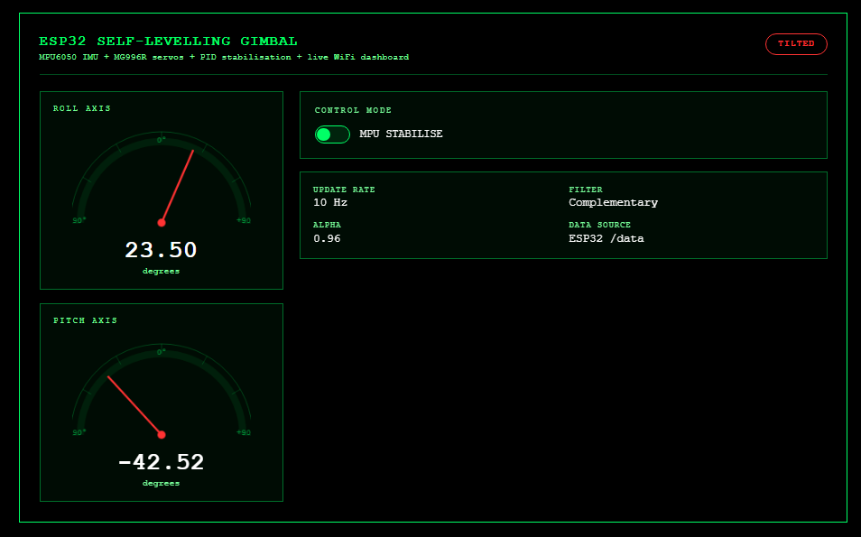
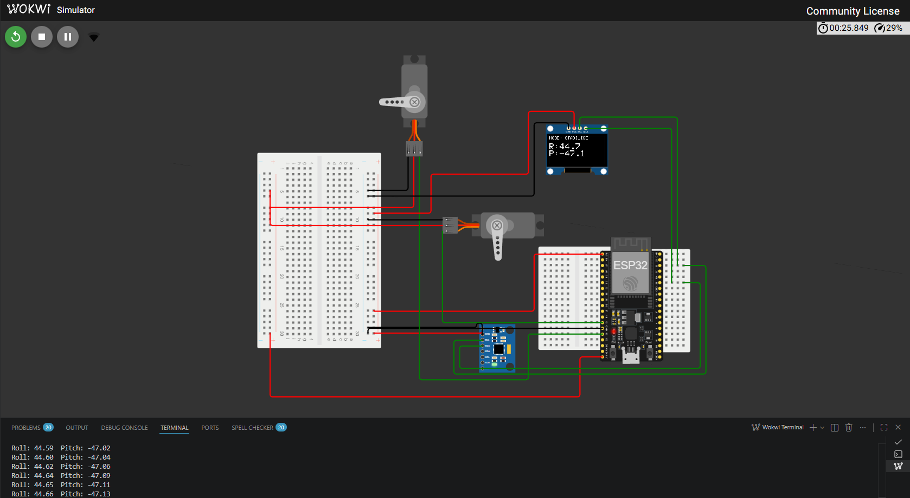
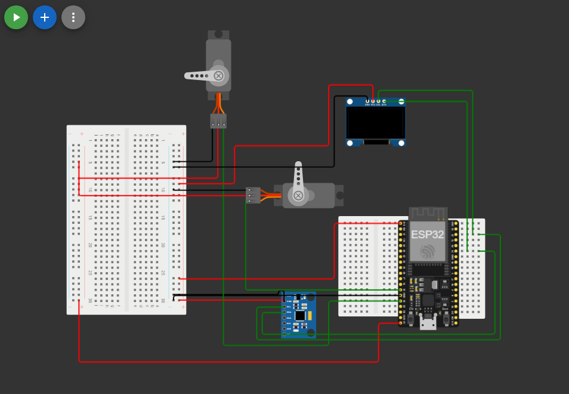

# ESP32 Self-Levelling Gimbal

ESP32 + MPU6050 self-levelling gimbal platform with PID control, OLED display, servo actuation, and a live WiFi dashboard.

A two-axis stabilising platform built around an ESP32 microcontroller, MPU6050 IMU, and MG996R servos. The system reads live roll and pitch angles from the IMU, filters the sensor data, and uses a PID control loop to correct the platform angle in real time.

The project also includes a live browser dashboard for monitoring roll/pitch angles and manually controlling the target angles through sliders.

## Current Status

✅ Wokwi simulation working  
✅ MPU6050 IMU simulation working  
✅ Complementary filter implemented  
✅ PID control loop implemented  
✅ Roll and pitch servo control working in simulation  
✅ OLED display showing live angle and mode  
✅ Live WiFi dashboard working  
✅ Manual dashboard control mode working  
✅ Reset to flat button working  
✅ Heartbeat safety system added  
✅ Dashboard layout cleaned up  
⏳ Real ESP32 breadboard build next  
⏳ Carrier PCB design planned  
⏳ Fusion 360 / 3D printed frame planned

## Demo Preview

The project was first built and tested in Wokwi simulation before moving to real hardware.

The simulation was used to check the code logic, dashboard layout, OLED output, IMU readings, PID behaviour, and servo response before powering the physical circuit.

---

### Simulation Preview

#### Web Dashboard Simulation



#### Wokwi Circuit Simulation



#### OLED Display Simulation



---

### Real Hardware Test

Real hardware testing has not been completed yet.

The next stage is to build the circuit on a breadboard using the ESP32, MPU6050, OLED display, and two MG996R servos powered from a separate 5V supply.

Planned hardware photos will be added here once the real build is complete.

#### Full Hardware View


#### Close-Up Hardware View


#### Final Gimbal Assembly


## Features

- Two-axis stabilisation using roll and pitch control
- MPU6050 accelerometer and gyroscope angle sensing
- Complementary filter for smoother angle estimation
- PID control loop for real-time correction
- MG996R servo control for roll and pitch movement
- Live WiFi dashboard hosted by the ESP32
- Dashboard gauges showing live roll and pitch angles
- Manual dashboard control mode using sliders
- Reset to flat button for returning both axes to level
- OLED display showing:
  - Roll angle
  - Pitch angle
  - Current mode
  - WiFi/dashboard status
- Heartbeat safety system:
  - If the browser is closed, the ESP32 automatically returns to stabilise mode
- Wokwi simulation support
- PlatformIO project structure
- Carrier PCB planned so the ESP32, servos, IMU, and OLED can be plugged in using headers

## Components Used

| Component                | Purpose                                                              |
| ------------------------ | -------------------------------------------------------------------- |
| ESP32 Dev Board          | Main microcontroller and WiFi web server                             |
| MPU6050 IMU              | Measures roll and pitch angle using accelerometer and gyroscope data |
| MG996R Servo x2          | Controls roll and pitch movement                                     |
| 0.96 inch I2C OLED       | Displays live angle and mode information                             |
| Breadboard               | Temporary circuit build and testing                                  |
| Jumper Wires             | Circuit connections                                                  |
| External 5V Supply       | Powers the MG996R servos safely                                      |
| Common Ground Connection | Ensures ESP32 and servo power supply share the same reference        |

## Pin Connections

| Module      |    Pin | ESP32 / Power Connection |
| ----------- | -----: | -----------------------: |
| MPU6050     |    SDA |                  GPIO 21 |
| MPU6050     |    SCL |                  GPIO 22 |
| MPU6050     |    VCC |               ESP32 3.3V |
| MPU6050     |    GND |                ESP32 GND |
| OLED        |    SDA |                  GPIO 21 |
| OLED        |    SCL |                  GPIO 22 |
| OLED        |    VCC |               ESP32 3.3V |
| OLED        |    GND |                ESP32 GND |
| Roll Servo  | Signal |                  GPIO 13 |
| Pitch Servo | Signal |                  GPIO 12 |
| Servos      |    VCC |         External 5V rail |
| Servos      |    GND |        External GND rail |

> The MPU6050 and OLED share the same I2C bus on GPIO 21 and GPIO 22.

> MPU6050 address: `0x68`  
> OLED address: `0x3C`

## Power Setup

The ESP32 is powered through USB.

The MPU6050 and OLED are powered from the ESP32 3.3V pin.

The MG996R servos should not be powered from the ESP32 3.3V pin. They require a separate 5V supply because servos can draw much more current than the ESP32 can safely provide.

All grounds must be connected together so the ESP32 and servo supply share the same reference.

```text
ESP32 USB power → ESP32 + MPU6050 + OLED

External 5V supply → MG996R roll servo + MG996R pitch servo

External supply GND → ESP32 GND
```

## Servo Power Warning

The MG996R servos should be powered from a separate 5V rail.

Do not power the servos directly from:

```text
ESP32 3.3V pin
ESP32 5V pin from USB
```

A weak servo power supply can cause:

- Servo jitter
- ESP32 resets
- Unstable PID behaviour
- Brownouts
- Dashboard disconnections

## WiFi Dashboard

The ESP32 connects to WiFi and serves a browser dashboard.

For simulation in Wokwi, the SSID is:

```cpp
const char* ssid = "Wokwi-GUEST";
const char* password = "";
```

For real hardware, update these lines in `main.cpp`:

```cpp
const char* ssid     = "YOUR_WIFI_SSID";
const char* password = "YOUR_WIFI_PASSWORD";
```

Once connected, the ESP32 prints its IP address to the serial monitor. Open that IP address in a browser to access the dashboard.

## Dashboard Modes

### MPU Stabilise Mode

This is the default mode.

The ESP32 reads the MPU6050 angle data and uses the PID controller to move the servos and keep the platform level.

The dashboard shows live roll and pitch values using gauge displays.

### Dashboard Control Mode

This mode allows manual control from the browser.

The roll and pitch sliders set the target angles. The servos then move to hold those target angles.

This is useful for:

- Testing servo movement
- Checking dashboard control
- Demonstrating manual angle control
- Debugging the PID response

### Heartbeat Safety System

The dashboard sends a heartbeat signal to the ESP32 while the browser is open.

If the browser is closed or disconnected, the ESP32 detects the lost heartbeat and automatically returns to MPU stabilise mode.

This prevents the system from staying stuck in manual control mode.

## PID Tuning

Current PID values used in the Wokwi simulation:

| Axis  |  Kp |  Ki |  Kd |
| ----- | --: | --: | --: |
| Roll  | 2.5 | 0.0 | 0.4 |
| Pitch | 2.5 | 0.0 | 0.4 |

These values are only simulation values.

They will likely need changing on the real gimbal because the real system will have:

- Servo weight
- Platform weight
- Mechanical friction
- Servo backlash
- Inertia
- Power supply limits

Recommended tuning approach:

1. Set Ki and Kd to 0
2. Increase Kp until the platform responds quickly
3. If it oscillates, reduce Kp slightly
4. Add Kd to reduce overshoot and shaking
5. Add Ki only if the platform has a steady offset that does not disappear

## Problems Faced and Fixes

| Problem                                           | Fix                                                                 |
| ------------------------------------------------- | ------------------------------------------------------------------- |
| Dashboard sliders were too long                   | Reduced the control panel width using CSS grid sizing               |
| Outer dashboard box was too wide                  | Used `width: fit-content` on the main dashboard container           |
| Dashboard was stuck near the top of the screen    | Used flexbox on the `body` to centre it vertically and horizontally |
| MPU6050 and OLED both need I2C                    | Shared GPIO 21/22 because they use different I2C addresses          |
| Servo power cannot safely come from ESP32 3.3V    | Planned separate 5V servo power rail with common ground             |
| Simulation PID values may not match real hardware | Real gimbal will be retuned after physical assembly                 |

## Future Improvements

- Build and test the real breadboard circuit
- Tune PID values on real hardware
- Design a carrier PCB with headers for reusable parts
- Create a KiCad / Altium schematic
- Order the PCB through JLCPCB
- Design a Fusion 360 frame around the PCB dimensions
- 3D print the gimbal frame
- Add cleaner wiring and cable management
- Add live PID tuning from the dashboard
- Add data logging for roll, pitch, target angle, and servo output
- Add graphs showing angle response over time
- Record final demo video for portfolio and CV

## How It Works

The MPU6050 measures motion using an accelerometer and gyroscope.

The accelerometer gives an angle estimate based on gravity, but it can be noisy.  
The gyroscope gives smooth short-term motion data, but it can drift over time.

A complementary filter combines both readings:

```text
filtered angle = gyro short-term angle + accelerometer long-term correction
```

The ESP32 compares the measured angle with the target angle.

```text
error = target angle - measured angle
```

The PID controller uses this error to calculate a correction output.

```text
PID output = proportional correction + integral correction + derivative correction
```

The correction output is then converted into servo movement.

For the gimbal:

```text
MPU6050 angle → Complementary filter → PID controller → Servo angle → Platform correction
```

In stabilise mode, the target angle is 0 degrees, so the platform tries to stay level.

In dashboard control mode, the target angle comes from the browser sliders.

## Software

Built with PlatformIO in VSCode using the Arduino framework.

### Dependencies

Add to `platformio.ini`:

```ini
[env:esp32dev]
platform = espressif32
board = esp32dev
framework = arduino
monitor_speed = 115200
lib_deps =
    electroniccats/MPU6050
    madhephaestus/ESP32Servo
    adafruit/Adafruit SSD1306
    adafruit/Adafruit GFX Library
```

## How to Run

1. Clone the repo.
2. Open the project in VSCode.
3. Install the PlatformIO extension.
4. Build the project.
5. Upload it to the ESP32.
6. Open the serial monitor at `115200` baud.
7. Wait for the ESP32 to print its IP address.
8. Open the IP address in a browser.

For Wokwi simulation:

1. Build the project first.
2. Open `diagram.json`.
3. Press play using the Wokwi VSCode extension.
4. Open the simulated ESP32 IP/dashboard when shown.

## Project Pipeline

- [x] Wokwi simulation
- [x] MPU6050 angle reading
- [x] Complementary filter
- [x] PID control loop
- [x] Servo control
- [x] OLED display
- [x] WiFi dashboard
- [x] Manual dashboard control
- [x] Dashboard layout cleaned up
- [ ] Real breadboard test
- [ ] Real PID tuning
- [ ] KiCad / Altium schematic
- [ ] Carrier PCB layout
- [ ] Order PCB
- [ ] Fusion 360 CAD frame
- [ ] 3D print frame
- [ ] Final assembly
- [ ] Demo video
- [ ] Portfolio write-up

## Demo Video

A demo video has not been added yet.

Planned final video:

- Show the real gimbal correcting tilt
- Show the OLED updating live roll and pitch
- Show the WiFi dashboard changing in real time
- Show manual dashboard control using the sliders
- Show reset to flat mode

[Watch the demo video](docs/media/gimbal-demo-v1.mp4)

## Author

**Farhan Ali** — Engineering Student / Embedded Systems Project  
[GitHub](https://github.com/farhan10904) | [Portfolio](https://pacific-attention-6cd.notion.site/Farhan-Ali-Engineering-Portfolio-2c0495dbdc658028a0decf9447459ea6#367495dbdc65808eb791f741fc051231) | [LinkedIn](https://www.linkedin.com/in/farhan-ali-95047a245/)

Built as an independent portfolio project to practise ESP32 development, IMU sensor fusion, PID control, servo actuation, WiFi dashboards, PCB planning, and mechanical gimbal design.

## Acknowledgements

Developed with support from Claude by Anthropic and ChatGPT by OpenAI as part of a self-directed engineering project.

AI tools were used for planning support, debugging help, code review, and documentation improvements. The hardware choices, wiring, PID tuning, dashboard layout, and final project direction were decided, reviewed, and understood by the author.
