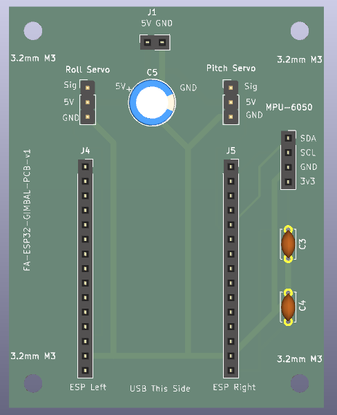
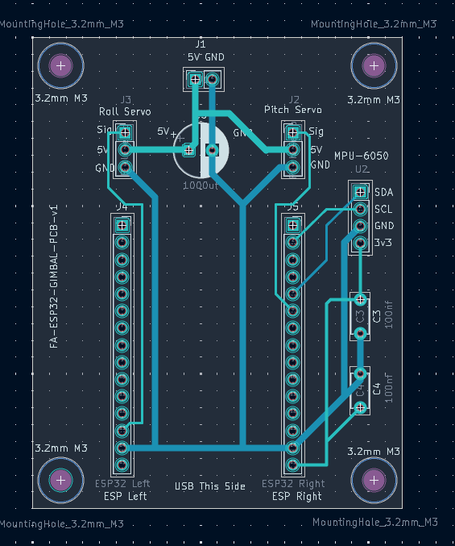
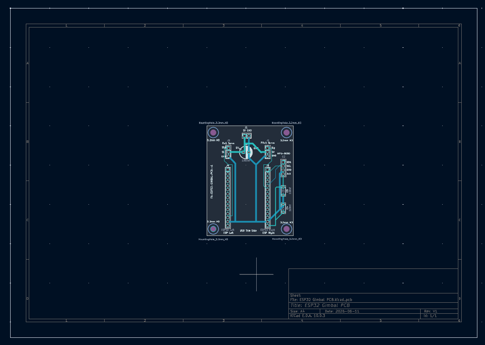
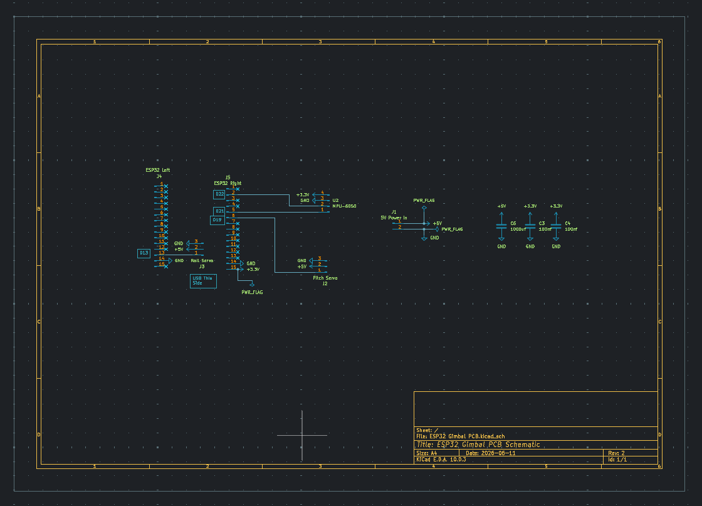

# ESP32 Self-Levelling Gimbal

ESP32-based two-axis self-levelling gimbal platform using an MPU6050 IMU, MG996R servos, PID control, a live WiFi dashboard, and a custom KiCad carrier PCB.

The project was built to understand embedded control systems, IMU sensor fusion, PID tuning, servo actuation, WiFi dashboards, and PCB carrier-board design.

---

## Project Summary

This project controls a two-axis gimbal platform using live roll and pitch angle data from an MPU6050 IMU.

The ESP32 reads the IMU data, applies a complementary filter, calculates correction values using a PID control loop, and drives two MG996R servos to keep the platform level.

The system also includes a browser dashboard hosted by the ESP32 for:

- live roll and pitch monitoring
- manual servo control
- reset-to-flat control
- switching between stabilisation and dashboard control modes

A custom KiCad carrier PCB was designed after breadboard testing to make the wiring cleaner and allow the ESP32, servo connectors, power input, and remote IMU cable to plug into a permanent board while keeping the main modules reusable.

---

## Current Status

- [x] Wokwi simulation completed
- [x] MPU6050 angle reading implemented
- [x] Complementary filter implemented
- [x] PID control loop implemented
- [x] Roll and pitch servo control working
- [x] WiFi dashboard working
- [x] Manual dashboard control working
- [x] Reset-to-flat control working
- [x] Heartbeat safety system implemented
- [x] Real ESP32 breadboard test completed
- [x] Real servo and IMU behaviour tested
- [x] KiCad carrier PCB schematic completed
- [x] KiCad PCB layout routed
- [x] PCB DRC check passed
- [x] 3D PCB preview generated
- [x] PCB order
- [ ] Fusion 360 / 3D printed frame
- [ ] Final mechanical assembly
- [ ] Final demo video

---

## Demo / Design Preview

### 3D PCB Preview



### PCB Routing Layout



### Initial Schematic Sheet


### Final Carrier Board Schematic



### Full Schematic Sheet



---

## Simulation Preview

The project was first built and tested in Wokwi before moving to real hardware.

The simulation was used to check:

- ESP32 code structure
- MPU6050 angle readings
- PID logic
- servo response
- WiFi dashboard layout
- manual dashboard control
- reset-to-flat behaviour

### Web Dashboard Simulation


### Wokwi Circuit Simulation


---

## Features

- Two-axis roll and pitch stabilisation
- MPU6050 accelerometer and gyroscope angle sensing
- Complementary filter for smoother roll/pitch estimation
- PID control loop for real-time attitude correction
- MG996R servo control
- ESP32-hosted WiFi dashboard
- Live roll and pitch values in browser
- Manual dashboard control mode
- Reset-to-flat button
- Heartbeat safety system:
  - if the dashboard disconnects, the ESP32 returns to stabilisation mode

- Real breadboard hardware test
- Custom KiCad carrier PCB
- Remote MPU6050 connector so the IMU can be mounted on the moving platform
- 1000 µF bulk capacitor on the 5V servo rail
- Separate 5V servo power input
- Common ground between ESP32, servo supply, and IMU

---

## Hardware Used

| Component                            | Purpose                                        |
| ------------------------------------ | ---------------------------------------------- |
| ESP32 Dev Board                      | Main microcontroller and WiFi dashboard server |
| MPU6050 IMU                          | Measures roll and pitch angle                  |
| MG996R Servo x2                      | Controls roll and pitch axes                   |
| External 5V Supply / Boost Converter | Powers the servos                              |
| 1000 µF Electrolytic Capacitor       | Reduces servo voltage dips                     |
| 100 nF Ceramic Capacitors            | Local power decoupling                         |
| Custom KiCad Carrier PCB             | Permanent wiring carrier board                 |
| Jumper / Servo Wires                 | Connects remote IMU and servos                 |
| 3D Printed Frame                     | Planned mechanical gimbal frame                |

---

## Final Pin Connections

| Module      |      Pin | ESP32 / Power Connection            |
| ----------- | -------: | ----------------------------------- |
| MPU6050     |      SDA | GPIO 21                             |
| MPU6050     |      SCL | GPIO 22                             |
| MPU6050     |      VCC | ESP32 3.3V                          |
| MPU6050     |      GND | Common GND                          |
| Roll Servo  |   Signal | GPIO 13                             |
| Pitch Servo |   Signal | GPIO 19                             |
| Servos      |      VCC | External 5V rail                    |
| Servos      |      GND | External GND rail                   |
| ESP32       | VIN / 5V | 5V input rail if externally powered |
| ESP32       |      GND | Common GND                          |

> The MPU6050 is connected through a remote 4-pin connector so it can be mounted on the moving platform instead of fixed to the PCB.

Remote IMU connector order:

```text
SDA
SCL
GND
3V3
```

Servo connector order:

```text
SIG
5V
GND
```

---

## Power Setup

The servos are powered from a separate 5V rail because MG996R servos can draw much more current than the ESP32 can safely provide.

The ESP32, servo supply, and MPU6050 must share a common ground.

```text
External 5V supply → servo 5V rail
External GND       → servo GND rail
ESP32 GND          → common GND
MPU6050 VCC        → ESP32 3.3V
MPU6050 GND        → common GND
```

The carrier PCB includes:

- 5V power input connector
- 1000 µF capacitor across 5V and GND
- 100 nF capacitors on logic power rails
- 1 mm traces for 5V and GND power paths
- 0.4 mm trace for 3.3V
- 0.3 mm traces for signal lines

---

## Servo Power Warning

Do not power MG996R servos directly from:

```text
ESP32 3.3V pin
ESP32 USB 5V pin
```

A weak or noisy servo power supply can cause:

- servo jitter
- ESP32 brownouts
- WiFi dropouts
- unstable PID correction
- random resets
- inconsistent angle response

The 1000 µF capacitor helps absorb short servo current spikes, but it does not replace a proper 5V supply.

---

## Carrier PCB Design

The final carrier PCB was designed in KiCad to make the project cleaner and more reusable.

The board includes:

- ESP32 left/right socket headers
- roll servo header
- pitch servo header
- remote MPU6050 connector
- 5V power input
- 1000 µF servo rail capacitor
- 100 nF decoupling capacitors
- M3 mounting holes
- labelled silkscreen for all connectors
- wide 5V and GND traces for servo current

The ESP32 and MPU6050 are not permanently soldered to the PCB. The design uses sockets/connectors so the main modules can be removed and reused.

---

## Why the MPU6050 Is Remote

The MPU6050 must measure the angle of the moving platform.

If the IMU is fixed to the base or handle, it measures the wrong body and the PID loop corrects the wrong motion.

Final design:

```text
Main PCB → fixed to handle/base
MPU6050 → mounted on moving platform
Connection → 4-wire remote cable
```

The I2C wires should be kept reasonably short and routed away from servo power wires.

---

## WiFi Dashboard

The ESP32 connects to WiFi and serves a local browser dashboard.

For Wokwi simulation:

```cpp
const char* ssid = "Wokwi-GUEST";
const char* password = "";
```

For real hardware, update the WiFi credentials in `main.cpp`:

```cpp
const char* ssid     = "YOUR_WIFI_SSID";
const char* password = "YOUR_WIFI_PASSWORD";
```

Once connected, the ESP32 prints its IP address to the serial monitor.

Open that IP address in a browser to access the dashboard.

---

## Dashboard Modes

### Stabilise Mode

Default mode.

The ESP32 reads roll and pitch from the MPU6050, calculates the error from level, and uses PID output to move the servos.

```text
Target angle = 0°
Measured angle = MPU6050 filtered angle
Error = target angle - measured angle
```

### Dashboard Control Mode

Manual control mode.

The browser sliders set the target roll and pitch angles. The servos move to hold those target angles.

Useful for:

- checking servo direction
- testing dashboard control
- debugging PID response
- showing manual control in a demo

### Heartbeat Safety

The browser sends a heartbeat signal while the dashboard is open.

If the ESP32 stops receiving the heartbeat, it automatically returns to stabilise mode.

This prevents the system from staying stuck in manual control mode after the browser closes.

---

## PID Control

Current baseline PID values:

| Axis  |  Kp |  Ki |  Kd |
| ----- | --: | --: | --: |
| Roll  | 2.5 | 0.0 | 0.4 |
| Pitch | 2.5 | 0.0 | 0.4 |

These values worked as a starting point but may need adjustment once the final 3D printed frame is assembled.

Recommended tuning process:

1. Set `Ki = 0` and `Kd = 0`.
2. Increase `Kp` until the platform corrects quickly.
3. If it oscillates, reduce `Kp`.
4. Add `Kd` to reduce overshoot.
5. Only add `Ki` if there is a steady offset that does not disappear.

---

## How It Works

The MPU6050 provides accelerometer and gyroscope data.

The accelerometer gives a gravity-based angle estimate but is noisy during movement.

The gyroscope gives smooth short-term angle changes but drifts over time.

A complementary filter combines both:

```text
filtered angle = gyro short-term estimate + accelerometer long-term correction
```

The ESP32 then compares the filtered angle with the target angle:

```text
error = target angle - measured angle
```

The PID controller calculates the correction:

```text
PID output = proportional + integral + derivative correction
```

The correction is converted into servo angle commands:

```text
MPU6050 → complementary filter → PID → servo output → platform correction
```

---

## Problems Faced and Fixes

| Problem                                              | Fix                                                                |
| ---------------------------------------------------- | ------------------------------------------------------------------ |
| Dashboard layout was too wide                        | Reworked CSS layout and container sizing                           |
| Manual sliders needed cleaner control                | Added dashboard control mode                                       |
| Browser disconnect could leave system in manual mode | Added heartbeat safety system                                      |
| GPIO12 was originally used for pitch servo           | Changed pitch servo to GPIO19 to avoid ESP32 boot-strapping issues |
| Servos caused high current demand                    | Added separate 5V servo rail and 1000 µF capacitor                 |
| MPU6050 needed to move with the platform             | Changed PCB design to use a remote IMU connector                   |
| ESP32 module needed to stay reusable                 | Used 2x 1x15 socket headers                                        |
| PCB mounting needed to fit a printed frame           | Added M3 mounting holes                                            |

---

## Software

Built with PlatformIO in VS Code using the Arduino framework.

### `platformio.ini`

```ini
[env:esp32dev]
platform = espressif32
board = esp32dev
framework = arduino
monitor_speed = 115200
lib_deps =
    electroniccats/MPU6050
    madhephaestus/ESP32Servo
```

---

## How to Run

1. Clone the repo.
2. Open the project in VS Code.
3. Install the PlatformIO extension.
4. Connect the ESP32 by USB.
5. Build the project.
6. Upload it to the ESP32.
7. Open the serial monitor at `115200` baud.
8. Wait for the ESP32 to print its IP address.
9. Open that IP address in a browser.

---

## Wokwi Simulation

1. Open the project in VS Code.
2. Build the PlatformIO project.
3. Open `diagram.json`.
4. Run the Wokwi simulation.
5. Open the ESP32 dashboard URL shown in the serial monitor.

---

## Project Pipeline

- [x] Wokwi simulation
- [x] MPU6050 angle reading
- [x] Complementary filter
- [x] PID control loop
- [x] Servo control
- [x] WiFi dashboard
- [x] Manual dashboard mode
- [x] Dashboard safety heartbeat
- [x] Real breadboard hardware test
- [x] KiCad schematic
- [x] KiCad carrier PCB layout
- [x] PCB DRC check
- [x] PCB 3D preview
- [x] Upload final KiCad files
- [x] Order PCB
- [ ] Design 3D printed frame
- [ ] Mount PCB to handle/base
- [ ] Mount MPU6050 to moving platform
- [ ] Final PID tuning
- [ ] Final demo video
- [ ] Portfolio write-up

---

## Planned Demo Video

The final demo video will show:

- gimbal correcting roll and pitch movement
- dashboard showing live angle values
- manual dashboard control
- reset-to-flat behaviour
- PCB mounted inside/onto the gimbal frame
- remote MPU6050 mounted on the moving platform

---

## Repository Structure

```text
ESP32-Self-Levelling-Gimbal/
├── docs/
│   └── images/
│       ├── dashboard.png
│       ├── wokwi-circuit.png
│       ├── kicad-pcb-preview.png
│       ├── kicad-schematic-close-up.png
│       ├── kicad-schematic-full.png
│       └── kicad-pcb-editor-close-up.png
├── include/
├── lib/
├── src/
│   └── main.cpp
├── test/
├── diagram.json
├── platformio.ini
├── wokwi.toml
└── README.md
```

---

## Author

**Farhan Ali**
Engineering Student / Embedded Systems Project

- GitHub: [farhan10904](https://github.com/farhan10904)
- Portfolio: [Farhan Ali Engineering Portfolio](https://pacific-attention-6cd.notion.site/Farhan-Ali-Engineering-Portfolio-2c0495dbdc658028a0decf9447459ea6#367495dbdc65808eb791f741fc051231)
- LinkedIn: [Farhan Ali](https://www.linkedin.com/in/farhan-ali-95047a245/)

Built as an independent engineering project to practise embedded systems, control systems, PID tuning, IMU sensor fusion, PCB design, and mechanical prototyping.

---

## Acknowledgements

AI tools were used for planning support, debugging help, code review, and documentation improvements.

The hardware choices, circuit changes, PID testing, PCB design decisions, and final project direction were reviewed, tested, and understood by the author.
